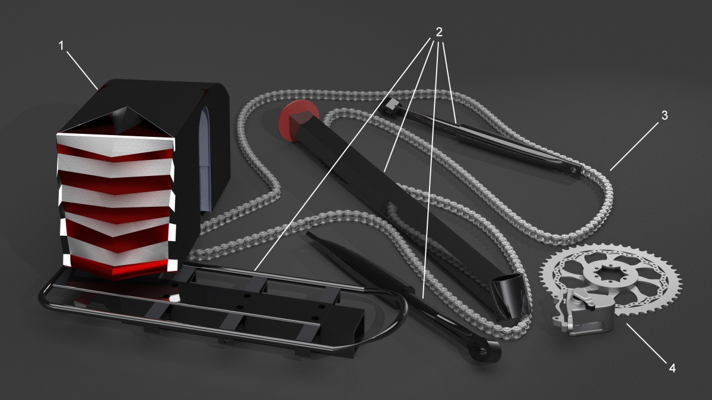
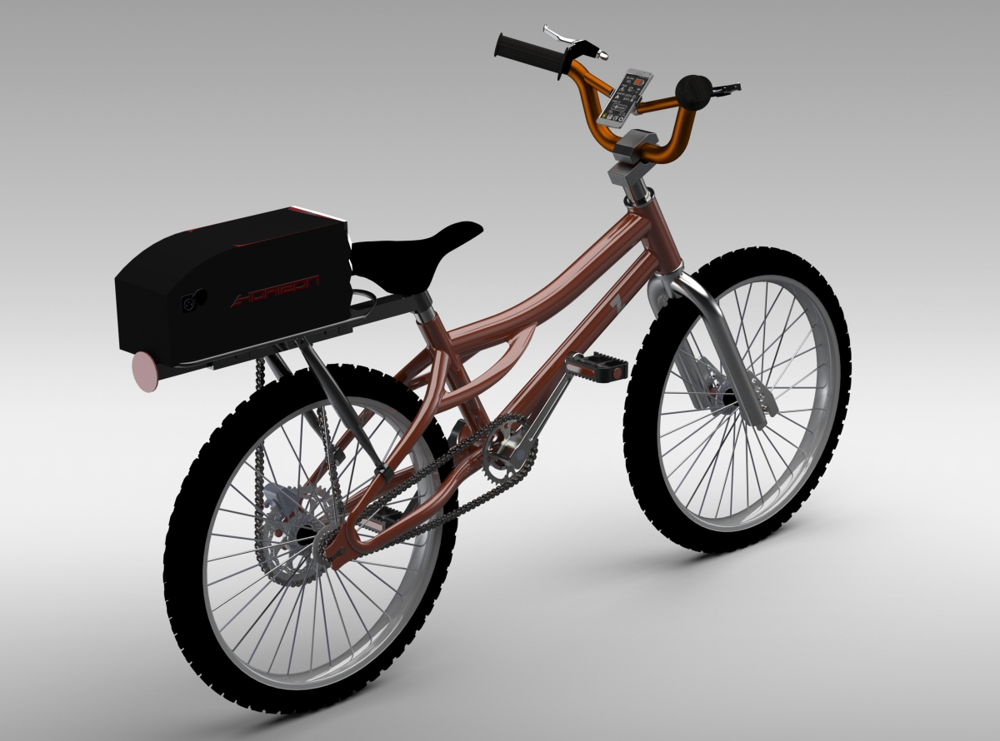
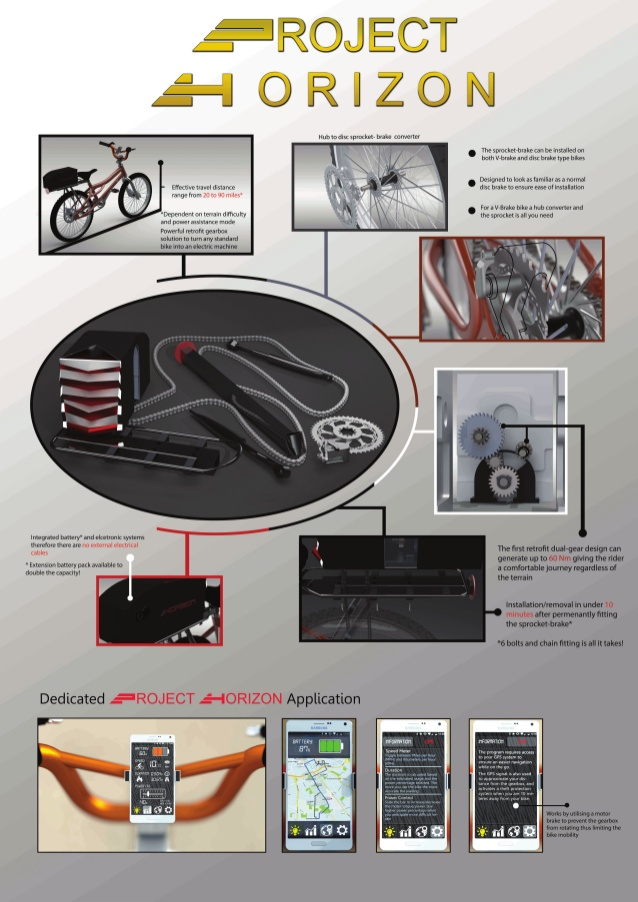
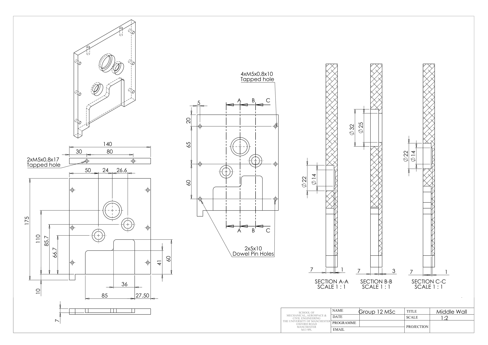
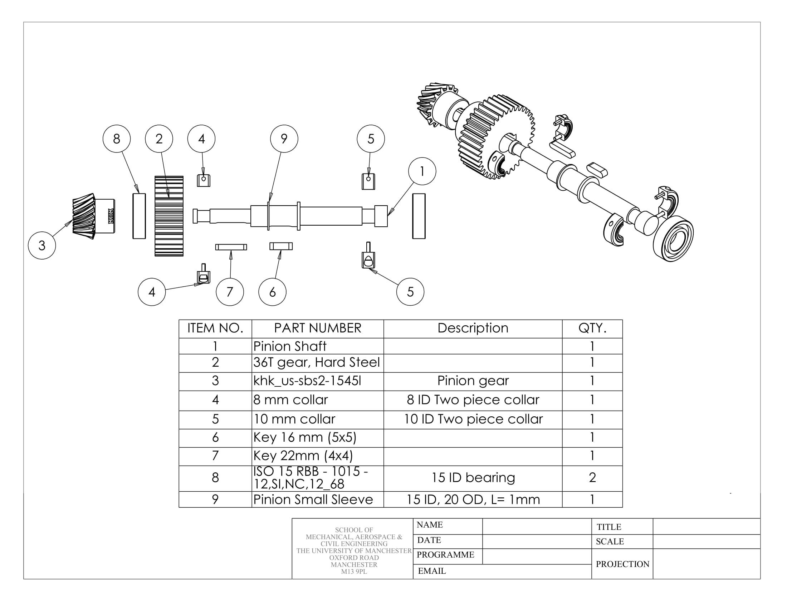
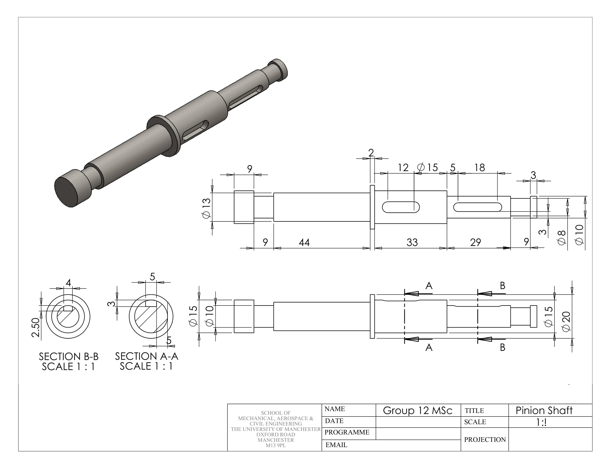
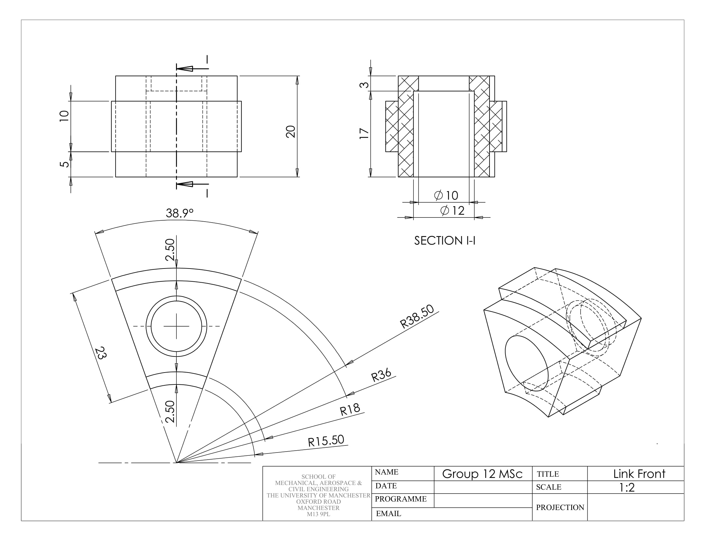

# Project Horizon
#### Group Design Project, The University of Manchester
#### Group members: Chenge Yang, Saif Al-Rubaye, Xiaokang Lin, Zixi Zhang, Huang Xu
 

  

-----------------------------------------------------------------------------------------
## Introduction
Project Horizon is an innovative two-chain retrofit e-bike conversion kit that can be installed onto and removed from any standard bike with only simple operations.

It is characterized with the following features:
* Powered by a 250W DC motor and a 24V battery pack
* Provides two gear sets and four drive modes to cope with different road conditions
* Controlled by an Arduino-based electronic control unit (ECU)
* Automatically start, shut down and gear shift

  
  

-----------------------------------------------------------------------------------------
## Project Poster

  

## Sample Drawings

  
  
  
  

